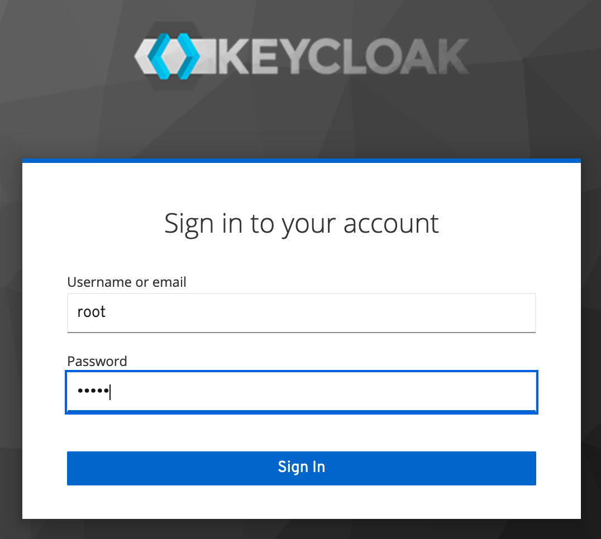
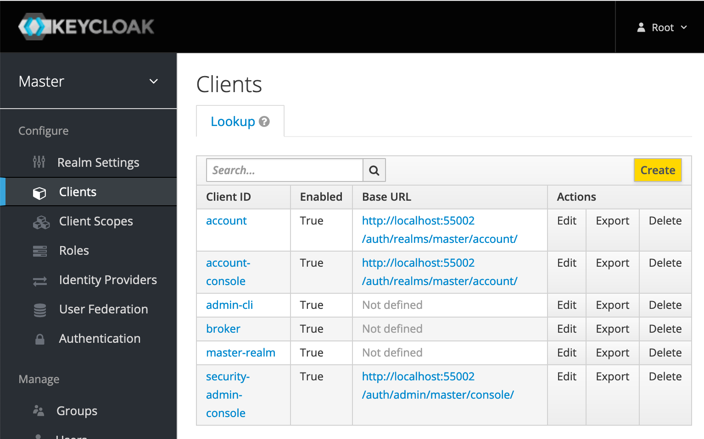
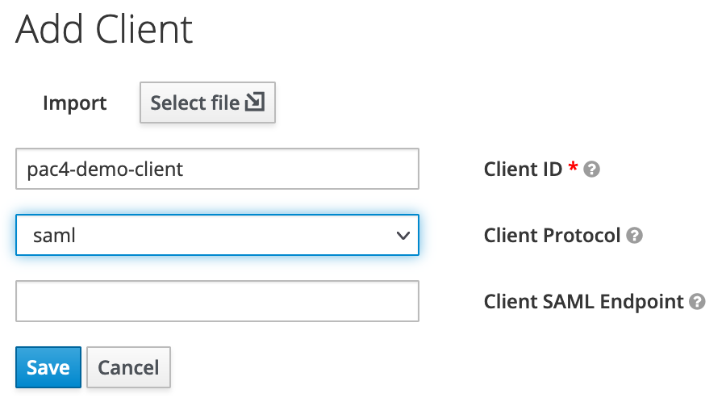
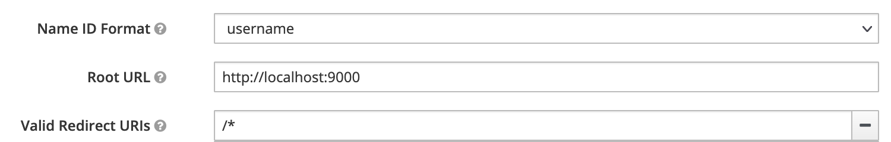
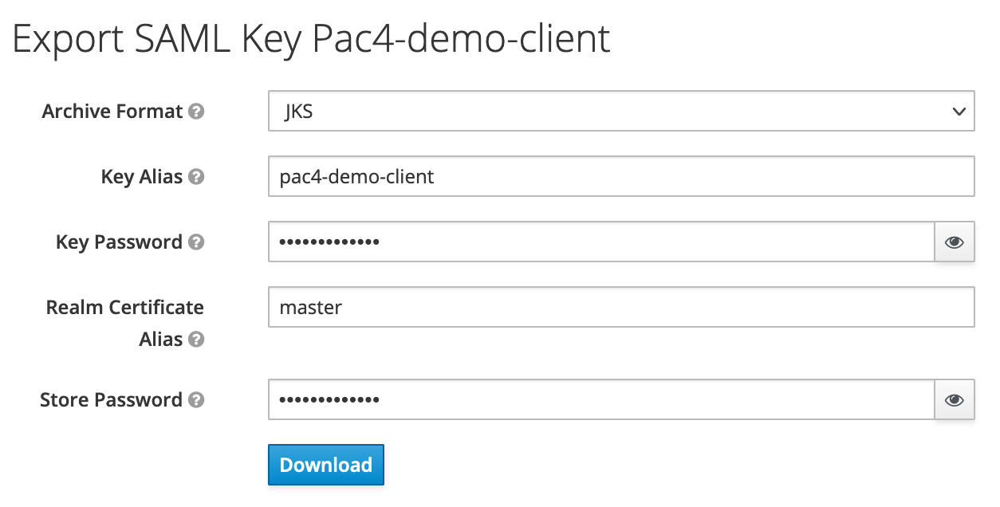
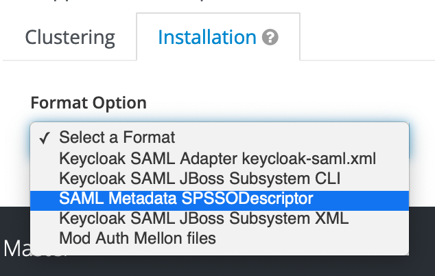
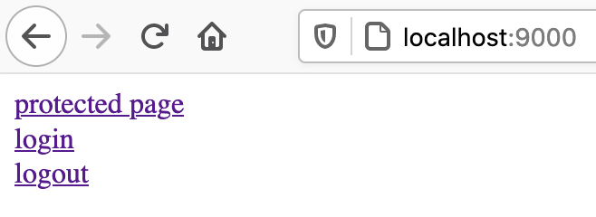
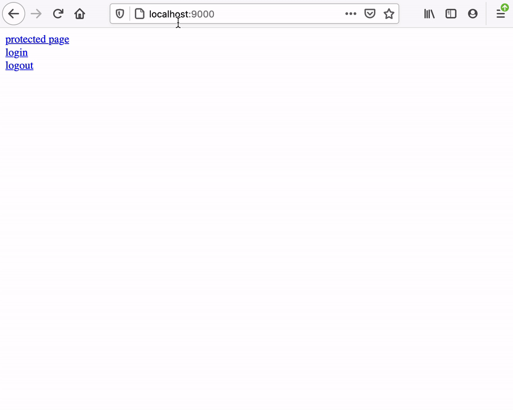

# Akka HTTP SAML authentication using PAC4J

Securing a Web application according [SAML](https://en.wikipedia.org/wiki/Security_Assertion_Markup_Language) can be quite challenging.

This is inspired from [akka-http-pac4j-demo](https://github.com/vidma/akka-http-pac4j-demo), to demonstrate how to secure a Scala/Akka HTTP webapp (the *Service Provider* or *SP* in SAML terminology) using [PAC4J](http://www.pac4j.org/).

The utility library [akka-http-pac4j](https://github.com/StackVista/akka-http-pac4j) is use to ease the integration.

**Requirements:**

- JDK 1.8+
- [SBT](https://www.scala-sbt.org/)
- [Docker](https://www.docker.com/) (recommanded)

## Local IDP

In order to be able to do it on local development environment, [Keycloak](https://www.keycloak.org/) is used as a local [SAML IDP](https://en.wikipedia.org/wiki/Identity_provider).

Keycloak can be freely [downloaded](https://www.keycloak.org/downloads), and [official Docker image](https://hub.docker.com/r/jboss/keycloak) can be used:

    docker run -p 8080:8080 -e KEYCLOAK_USER=root -e KEYCLOAK_PASSWORD=pac4j jboss/keycloak:12.0.4

Once Keycloak is started, its *Administration Console* can be access in a browser at http://localhost:8080/auth/admin/

The authorized clients for the realm *Master* can be list in the *Clients* module (left menu). From there a new client can be created.

On the creation screen, we set `pac4-demo-client` as client ID and make sure the *Client Protocol*  is `saml`.

Then the detailed Settings of the client can be edited; Most importantly:

- *Root URL*: `http://localhost:9000` for the base URL of the Webapp/SP to be secured
- *Valid Redirect URIs*: Pattern `/*`
- *Master SAML Processing URL*: `/callback` (for `http://localhost:9000/callback` considering the set root URL)

> Make sure to save (blue button at the bottom of the screen).

Once the client is configured, the *SAML Keys* are accessible from the corresponding tab on the top of the Client screen.
We will just export these keys as a keystore:

- *Archive Format*: `JKS`
- *Key Alias*: `pac4-demo-client`
- *Key Password*: `pac4-key-pass`
- *Store Password*: `pac4-store-pass`

It must be downloaded (as file `keystore.jks`).

Then the corresponding [SAML metadata for the Webapp/SP](https://wiki.shibboleth.net/confluence/display/CONCEPT/MetadataForSP) (aka SPSSODescriptor) is accessible from the *Installation* tab on the top-right of the client screen.

It must be downloaded (as file `saml-sp-metadata.xml`).

Finally, the metadata for Keycloak itself as IDP can be downloaded from http://localhost:8080/auth/realms/master/protocol/saml/descriptor and saved as file `idpssodescriptor.xml`.

## Secure the Webapp

The sources of the demo Webapp can be checked out from [GitHub](https://github.com/cchantep/akka-pac4j-saml-keycloak-demo).

The previous descriptors and keystore specifying the authorized SAML client must now be configure in the Webapp.

<!-- TODO: Remove
First the `saml-sp-metadata.xml` must be copied to `src/main/resources/sp-metadata.xml` in the application sources.
-->

First the `keystore.jks` must be copied to `src/main/resources/keystore.jks`.

Finally the `idpssodescriptor.xml` must be copied to `src/main/resources/idpssodescriptor.xml`.

## Test

At this point, the Webapp is properly configured as a secure SAML SP.
To test it, open http://localhost:9000 in a private window browser.

Then click on *protected page*. As not yet logged in, the browser will be redirected to the IDP (there the local Keycloak).

The root credentials (provided when configuring the Keycloak admin access) can be used to login.

Once logged, the browser is redirected back to the Webapp home, and the *protected page* is now accessible (the authenticated user is rendered as JSON there).

